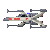

Java's most advanced Star Wars
=========================

FOLLOWING Files are taken from the Internet:
- /resources/uiFiles/empirePixelart.jpeg [Link](https://wallpaper.mob.org/pc/image/sci_fi-star_wars-pixel_art-461022.html)
- /resources/uiFiles/rebelPixelart.png [Link](https://64.media.tumblr.com/81d7ecde8e5a31ae09dfa38adace5117/2d8352260a227498-96/s540x810/aebee7b8a67893f5b1d16f1f691ed2c7d3bb4af7.png)

###HOW TO PLAY:

###HOW TO MODIFY THE GAME:

General Game Values (TAGS and MAP BUILDING) found in /modification/default_values.txt

**How to add a new Unit:**

To add a new Unit:

	1. CHOOSE a TAG Name for the .unit file {TAG}.unit
	2. ADD .unit file in /unit_stats following the orders in the /modification/unit_file_template.txt file
	3. ADD .png file in /units in format: {TAG}{FACTION (E/R)}.png for both Factions
	4. ADD every change to /modification/default_values.txt for Documentation
	
To add the new Unit to the Map Creator:

	1. ADD both (for every Faction) TAGs to [UNIT_TAGS:] in the /modification/Map_Creator.txt file 
	
**How to add a new Tile:**

To add a new Tile:

	1. CHOOSE a TAG for the Tile
	2. ADD the TAG to the corresponding ClassType (see /modification/default_values.txt) in /modification/Class_Types.txt
	3. ADD a .png file to /groundTiles named {TAG}.png
	4. ADD every change to /modification/default_values.txt for Documentation

To add the new Tile to the Map Creator:

	1. ADD the TAG to [TILE_TAGS:] in the /modification/Map_Creator.txt file
	

-------------------------
The only place in java where you can fight Advanced Wars in a galaxy far far away!! \

